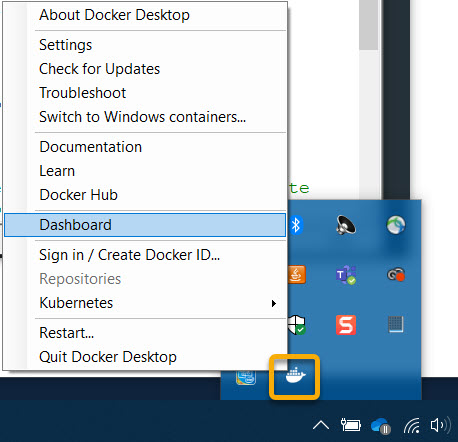
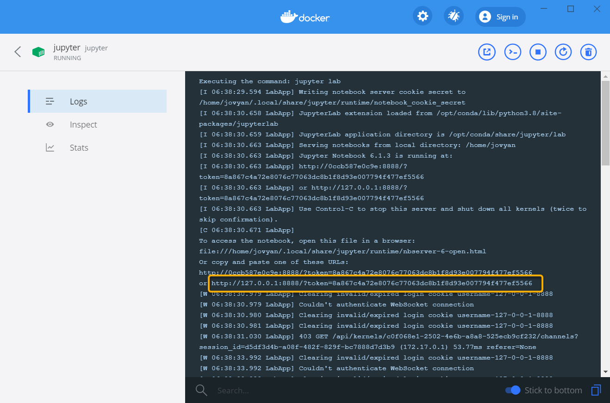

# ereefs-python-scripts
[](https://github.com/aims-ks/ereefs-python-scripts/blob/master/LICENSE)

These scripts provide a set of examples for processing eReefs data with Python. 

***

## List of notebooks

When developing scripts there are a number of data sources and services to consider. The most appropriate one depends on your data needs. Since the eReefs models can be extremely large you normally cannot simply download all the data then process it as you like. Typically the aggregate data is used to simply reduce the data to a manageable size. This repository includes a number of Jupyter notebooks that outline how to access the various data sources available from eReefs.

Note: At this stage we only have a few example scripts. More will be added in the future.

| Description | Data source | Notebook |
| -------------| ------- | ------------- |
| 1. Plot AIMS eReefs data as a map from OpeNDAP service | AIMS eReefs aggregate model data | [Notebook (Jupyter)](/notebooks/1-plot-aims-ereefs-map-data.ipynb) |
| 2. Plot AIMS eReefs time plot from OpeNDAP service | AIMS eReefs aggregate model data |[Notebook (Jupyter)](/notebooks/2-plot-aims-ereefs-time-plot.ipynb) |

### Raw CSIRO eReefs model data
After the CSIRO eReefs models are generated they made available publicly on the [NCI THREDDS service](https://dapds00.nci.org.au/thredds/catalogs/fx3/catalog.html). This makes the data available in two formats. You can download the data in [NetCDF](https://www.unidata.ucar.edu/software/netcdf/docs/netcdf_introduction.html) format using HTTPS, which can be done using a web browser or a download script, or you can use the [OpeNDAP](https://docs.opendap.org/index.php/QuickStart) service to access the data dynamically in a programming environment. OpeNDAP allows a program to pull sections of data from the service without downloading all the data first. You can pull data using OpeNDAP using libraries in most programming languages. 

The raw eReefs model data is more complex to process because the model data uses a curvilinear grid, rather an a regular grid. The curviliear grid means that the grid of data is warped so that it is curved to roughly follow the Queensland coastline. This reduces the number of cells that need simuating making the model faster. When using this data to determine the latitude and longitude of a given cell in the data matrix you need to look them up in separate latitude and longitude tables that represent the warping of the grid. Curvilinear grids cannot be processed directly in desktop GIS applications such as ArcGIS or GDAL.

Note: At this stage we don't have any example scripts operating directly off the raw CSIRO eReefs model data.

### AIMS eReefs aggregate model data
The AIMS eReefs platform takes the raw CSIRO eReefs data and generates aggregate data products turning the original hourly data, in curvilinear grid format, into daily, monthly and yearly data on a regular grid. The aggregation reduces the number of time steps in the data, whilst the conversion to a regular grid allows the data to be more easily processed. These derived data products are then made available via a [THREDDS service](http://thredds.ereefs.aims.gov.au/thredds/catalog.html) where you can download the data files in NetCDF format or access them via an OpeNDAP service. 

Note: At this time the AIMS eReefs THREDDS OpeNDAP service only provides access end points for individial NetCDF files, not whole time sequences. As a result the OpeNDAP end points correspond to typically only one month of data. We are working to join all the months of data into a single service that allows you to access any date, not just a month's worth.

### AIMS eReefs data extraction tool time series data
The [AIMS data extraction tool](https://extraction.ereefs.aims.gov.au/) allows users to extract time series data from the raw CSIRO eReefs model data at a set of locations specified by a CSV file. This service operates off the raw model data to provide the highest temporal resolution available. This service also allows the user to perform temporal aggregation on the data if needed. This aggregation then provides summary statistics for each time step.

## Installation and setup
The scripts are created as [Jupyter Notebooks](https://jupyter.org/). If you would like to run the notebooks in your
local environment, please refer to [Installing the Jupyter Software](https://jupyter.org/install.html) for more 
information. Alternatively, you can run the scripts in a Docker container with all dependencies automatically installed
as described in the next sections. 

### Run notebook in Docker with Jupyter Lab
This project contains a `Dockerfile` which creates a [Jupyter](https://jupyter.org/) container with Jupyter Lab 
activated, and the necessary libraries installed.

Docker allows you to run the package of software needed to run Jupyter with Python preinstalled. Docker allows a set of software to be bundled up as a single package. This software runs in a small Linux operating system environment. This package is called a Docker container. Using docker saves having to deal with all the complex installation of the software. You just need to install Docker and run few scripts.

1. Install Git so you can clone this repository to your machine. On windows I recommend would use [GitHub Desktop](https://desktop.github.com/). Alternatively you can simply download the repository as a zip file from Github.
2. Install [Docker](https://docs.docker.com/get-docker/) on your machine.
3. Run the ```1. Build-docker-container-Linux.sh``` or ```1. Build-docker-container-Win.bat``` depending on your platform. The Linux script will probably also work on Mac, but this is untested. This script will build the Docker container, based on the specification in the `Dockerfile`, downloading all the required software. This creates the 'jupyter' docker container that is then called from the startup script. This Docker container includes Python running in the Jupyter notebook environment. 
4. Run ```2. Start-notebook-Linux.sh``` or ```2. Start-notebook-Windows.bat``` depending on your platform. This will start the 'jupyter' Docker container created in the previous step.
5. You access the Jupyter notebook using your web browser. It then connects to the Jupyter webserver running in the Docker container. To access the Jupyter site from local host you will need a link to where it is running. This link includes a security key that changes each time it starts. As a result the link can change. The first time you run the Start script it will list this link in the script output. It will look something like: 
    ```
    http://127.0.0.1:8888/?token=6f15d26cbb55b45fc59e0d3b58ada954f8e2bf8138c66846
    ```
6. Open the link in your web browser. You will find all the scripts in the work/notebooks folder.

### Finding the Notebook link for an already running docker container.
Once your Docker container is running you can safely close the command line terminal that was used to start it. This will not stop the running container. If you now need to find the URL to the Jupyter notebook again you can find it in the container logs which are available through the Docker dashboard. On Windows right click on the Docker Desktop and open the Dashboard.



Click on the jupyter/datascience-notebook:julia-1.5.0 container then you will see the logs and the link needed to view the notebook.



You can also view the logs by running the following command line:
```bash
docker logs jupyter
```

## Reusing this notebook setup for your own scripts
If you want to use the structure and setup for your own scripting purposes it is probably best that you don't just add scripts to this Git repo. To make your own.
1. Create an empty Git repo on Github, then clone this repo to your local machine. I create them on Github first instead of locally as it sets up the link to Github without needed to do extra work. If you create it locally you can later set it up in Github.
2. Copy over the build and start scripts (1. Build-docker-container-Linux.sh, 1. Build-docker-container-Win.bat, 3. Start-datascience-notebook-Linux.sh, 2. Start-datascience-notebook-Win) and Dockerfile.
4. Make sure you have Docker installed then use the scripts to setup and start your own Jupyter notebook.
5. Make sure your .gitignore file contains entries to ignore the files generated by Jupyter.
```
# Ignore Jupyter temporary files
.ipynb_checkpoints
*/.ipynb_checkpoints/*
```

## Troubleshooting
Here are some potential problems that you might have and ways to resolve them.
### Running Start script fails with "Bind for 0.0.0.0:8888 failed: port is already allocated" error
This indicates that your docker container is already running and so it couldn't start a second container. To check if the container is running go to the Docker dashboard and from there you can see the container logs for the link to your running notebook, see the section on 'Finding the Notebook link for an already running docker container' for more information.

